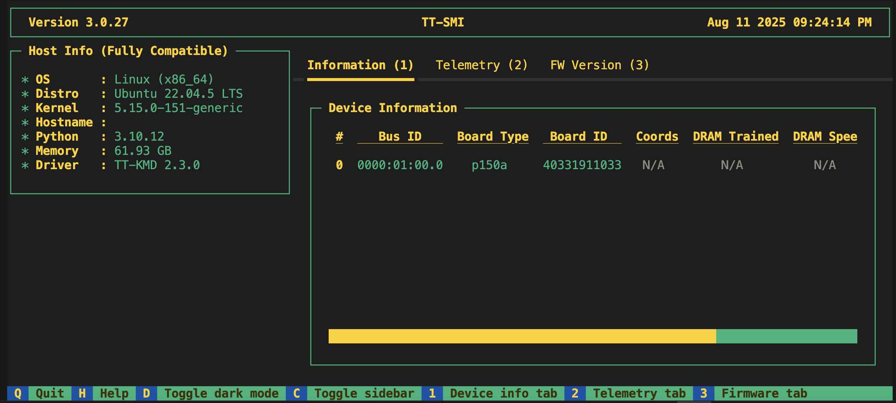

---
myst:
  html_meta:
    product-name: tt-installer, TT-Metalium™, TT-SMI, TT-Studio
    technology-concepts: software installation, Podman, containerization, driver
    document-type: how-to
---

# Installing the Tenstorrent Software Stack

This guide assists users who have completed the physical hardware setup of their Tenstorrent system. You will learn how to install the Tenstorrent software stack, including system dependencies, drivers, and the TT-Metalium™ development environment, and how to verify the installation.

## **Before You Begin**

Before you begin the software installation, ensure your host machine meets the following prerequisites:

* The host machine has an internet connection to download software packages.  
* The host machine has a supported operating system installed (Supported OS listed below)
  * Tenstorrent also supports [other operating systems](#running-the-installer-script) but are considered experimental at this point
* You have administrator privileges on the host machine.
* The system is physically unboxed and set up according to your product's installation manual and safety guidelines.

### **Supported Operating Systems**

Tenstorrent recommends Ubuntu 22.04 LTS (Jammy Jellyfish) for all Tenstorrent software. While each SDK may support newer distributions of Ubuntu, consider their compatibility experimental at this time.

### **BIOS Requirements**

The BIOS for your host motherboard should configure the PCIe AER Reporting Mechanism to be set to `OS First`. Tenstorrent's TT-SMI software requires this setting to function properly.

:::{important}
If you are using a TT-QuietBox, you do not have to worry about setting this option. It is set to `OS First` by default.

If you update or reset your BIOS for any reason, you must reconfigure the PCIe AER Reporting Mechanism setting to `OS First` to ensure TT-SMI functions correctly. This setting is typically located in the **Motherboard Information** section of your BIOS.
:::

---

## **Running the Installer Script**

Tenstorrent recommends using the [tt-installer](https://github.com/tenstorrent/tt-installer/) script to install the Tenstorrent software stack. This script automates the setup process and is compatible with Ubuntu, Fedora, and Debian operating systems.

### **1\. Execute the installer**
The installer has two dependencies, `curl` and `jq`. Install them using your system package manager. For example, on Ubuntu, run:

```bash
sudo apt update && sudo apt install -y curl jq
```

Now, to begin the installation, execute the following command in your terminal:

```bash
/bin/bash -c "$(curl -fsSL https://github.com/tenstorrent/tt-installer/releases/latest/download/install.sh)"
```

After displaying the ASCII logo and version information, the installer will ask you to confirm you want to proceed:
```
   __                  __                             __
  / /____  ____  _____/ /_____  _____________  ____  / /_
 / __/ _ \/ __ \/ ___/ __/ __ \/ ___/ ___/ _ \/ __ \/ __/
/ /_/  __/ / / (__  ) /_/ /_/ / /  / /  /  __/ / / / /_
\__/\___/_/ /_/____/\__/\____/_/  /_/   \___/_/ /_/\__/

[INFO] Welcome to tenstorrent!
...
[INFO] This script will install drivers and tooling and properly configure your tenstorrent hardware.
OK to continue? [Y/n]
```
**Answer "Y" to continue.**

### **2\. Choose Default or Custom Installation**
Next, the installer will ask whether you want to proceed with the default installation:
```
Would you like to proceed with the default installation?
Selecting yes enables non-interactive mode and continues with default options.
[Y/n]
```
**Press Enter or answer "Y" to accept the default installation.** This is the recommended path for most users. The installer will run everything with default options automatically -- you will not be prompted with any additional component questions.

:::{admonition} What does the default installation include?
:class: note
The default installation installs the following components:
* TT-KMD (kernel driver)
* HugePages
* SFPI
* Podman container runtime (with `podman-docker` compatibility shim)
* TT-Metalium slim container
* TT-Flash and firmware update
* TT-SMI
* tt-inference-server (cloned to `~/.local/lib/tt-inference-server`)
* TT-Studio (cloned to `~/.local/lib/tt-studio`)
* A new Python virtual environment at `~/.tenstorrent-venv`

Wrapper scripts for these tools are installed to `~/.local/bin/`.
:::

:::{admonition} Custom installation (advanced)
:class: tip
If you answer "N" to the default installation prompt, you will enter interactive mode where you can individually select which components to install, including the TT-Metalium slim container, the Model Demos container, Python package installation location, and more. This is intended for advanced users and developers who need to customize their setup. See [TT-NN / TT-Metalium Installation](https://docs.tenstorrent.com/tt-metal/latest/tt-metalium/installing.html#tt-nn-tt-metalium-installation) for additional manual installation instructions.
:::

### **3\. Grant Root Privileges**
The installer will ask you to grant the script sudo permissions:
```
[INFO] Starting installation
[INFO] Checking for sudo permissions... (may request password)
[sudo] password for <your-username>:
```
:::{admonition} Required
:class: warning
**Using sudo is required so you must enter your user's password.**
:::

### **4\. Install System Software Dependencies**
The installer will now install:
* [TT-KMD](https://github.com/tenstorrent/tt-kmd), the Kernel-Mode Driver
* [TT-Flash](https://github.com/tenstorrent/tt-flash), the utility to flash firmware blobs to Tenstorrent devices
* [TT-Firmware](https://github.com/tenstorrent/tt-firmware), the on-device firmware
* [HugePages](https://github.com/tenstorrent/tt-system-tools), a system tool for improving memory performance
* [TT-SMI](https://github.com/tenstorrent/tt-smi), the System Management Interface

### **5\. Reboot System**
:::{admonition} Important
:class: warning
If you used the default installation, the installer will **not** automatically reboot your system. **You must manually reboot if this is your first time running tt-installer on your system:**
```bash
sudo reboot
```
If you used the custom (interactive) installation, you will be prompted at the end of the installation process:
```
[INFO] Would you like to reboot now?
```
**Answer "Y" if this is your first time running tt-installer on your system.**
:::

---

## **Verify System Software Installation**
After rebooting your system, verify all system software dependencies were successfully installed and loaded. This section will introduce you to the [tt-smi](https://github.com/tenstorrent/tt-smi) tool, which we'll use to enumerate all Tenstorrent devices.

First, activate the Python virtual environment where the installer placed the required Python packages. If you used the default installation, execute this command:
```bash
source ~/.tenstorrent-venv/bin/activate
```

:::{note}
If you used a custom installation and chose a different Python package location, activate that environment instead.
:::

Next, execute this command to start tt-smi, then ensure the number of devices listed under the **"Device Information"** pane matches the number of Tenstorrent devices installed in your system:
```bash
tt-smi
```

Here is an example of what you should see for a system containing a single p150a device:


:::{admonition} Important
:class: danger
If the number of listed devices does not match what you expect, please [contact support](#need-additional-support) and we will assist you.
:::

Congratulations, you have successfully installed Tenstorrent's system software!

---

## **Troubleshooting** 

### No Tenstorrent devices detected! Please check your hardware and try again. Exiting... 

For Blackhole PCIe products such as p100 and p150, you may get an error message after running `tt-smi` that says no devices were detected. When this happens, do the following: 

1. Verify the card is being supplied power by checking when the system boots that the fan spins and the green power LED illuminates. 

2. If the light is on, try resetting the card. 

>**NOTE:** You can also try the command `lspci -d 1e52` - if it returns nothing it means the devices failed to enumerate. 

---

## **Exploring Alternative Installation Methods**

For advanced users or developers who prefer alternative installation methods for the software stack, refer to the [manual software installation guide.](./manual-software-install.md)

---

## **First Things To Do**
After tt-installer finishes successfully and you have restarted your system, you can proceed how you like. You may want to:

* **Use TT-Studio** -- TT-Studio is installed by default and is the recommended way to interact with your Tenstorrent hardware. Launch it by running `tt-studio` from your terminal. It provides a graphical interface for managing and monitoring your Tenstorrent devices.
* [Deploying LLMs](./vLLM-servers.md)
  * This is the recommended path users should take to deploy LLMs. The default installation already includes tt-inference-server.
* [Running model demos](./model-demos.md)
  * Explore pre-built demonstrations of popular models like Llama, Whisper, Stable Diffusion and ResNet.
  * This is a great way to see Tenstorrent's software in action without deep dives into model architecture.
* Understanding the [Tenstorrent Software Stack](./tt-software-stack.md).
* Learn more about our unique architecture by [reading this guide](https://github.com/tenstorrent/tt-metal/blob/main/METALIUM_GUIDE.md).

---

## **Need Additional Support?**
If you encounter any issues, or have a question that isn't covered in the documentation, please [raise a support request.](https://tenstorrent.atlassian.net/servicedesk/customer/portal/1) Our team will review your request and provide assistance.
