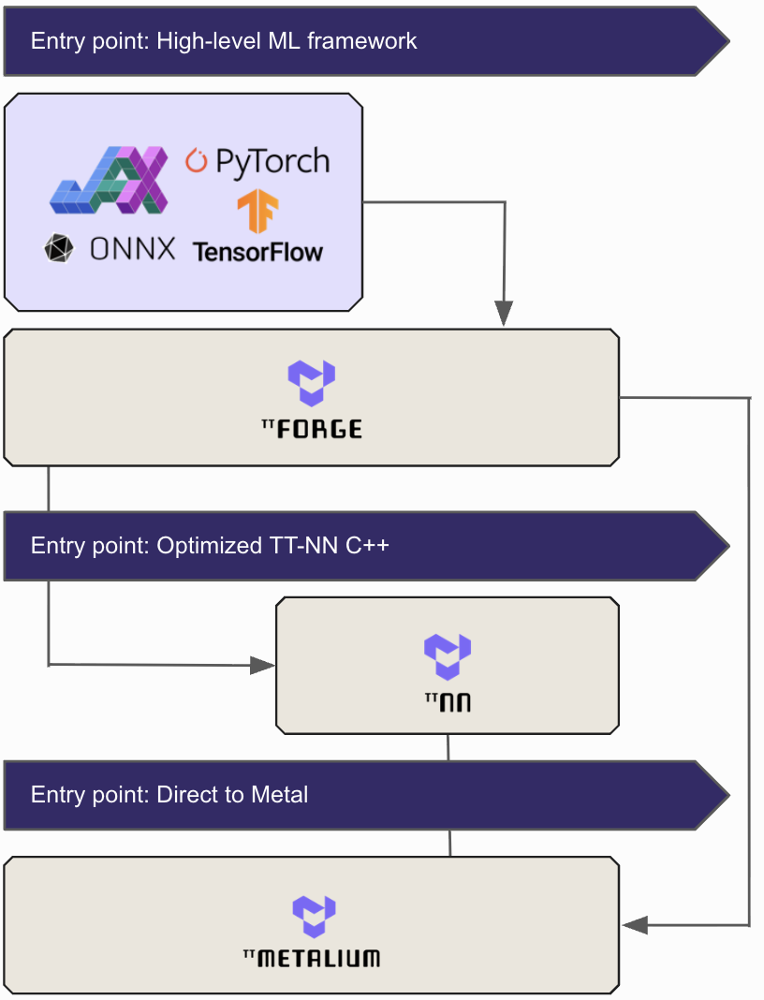

Understanding the Tenstorrent Software Stack
==============================================

.. meta::
   :product-name: TT-Metalium™, TT-NN™, TT-Forge™, Tensix core
   :technology-concepts: Machine Learning, High-Performance Computing, Neural Networks, Compilers, Multi-Level Intermediate Representation (MLIR), RISC-V, Network-on-Chip (NoC), Kernels, Jax, TensorFlow, PyTorch
   :document-type: Explanation

This document provides developers and researchers with an overview of the main components of the Tenstorrent software stack: TT-Metalium™, TT-NN™, and TT-Forge™. You will learn about each tool's purpose, use cases, and where to find its source code.

----

.. raw:: html

   

.. raw:: html

   

     

.. container:: software-stack-sections

   .. raw:: html

      <h1>TT-Forge™: The MLIR-Based Compiler</h1>

   TT-Forge™ is Tenstorrent's Multi-Level Intermediate Representation (MLIR)-based compiler. It bridges high-level machine learning frameworks with the Tenstorrent software stack.

   Interact with TT-Forge™ to compile models from frameworks such as `PyTorch <https://pytorch.org>`_, `JAX <https://docs.jax.dev/en/latest/>`_, and `TensorFlow <https://www.tensorflow.org>`_ for execution on Tenstorrent hardware. It offers an automated, general path to run many types of model architectures without requiring custom kernel development. TT-Forge™ integrates with and lowers to TT-Metalium for hardware execution.

   The main project is located in the `tt-forge <https://github.com/tenstorrent/tt-forge>`_ GitHub repository.

   .. raw:: html

      

   .. raw:: html

      <h1>TT-NN™: A Python & C++ Neural Network OP library</h1>

   TT-NN™ is a library of neural network operations that provides a user-friendly interface for running models on Tenstorrent hardware. It is designed to be intuitive for developers familiar with `PyTorch <https://pytorch.org>`_.

   Interact with TT-NN™ to run AI models using a familiar, high-level Python API without managing the complexities of the underlying hardware. TT-NN™ builds upon TT-Metalium™ and provides a stable set of pre-packaged, optimized operations. It is also available with a C++ API.

   The TT-NN™ library is part of the `tt-metal <https://github.com/tenstorrent/tt-metal>`_ GitHub repository.

.. raw:: html

     

     

.. raw:: html

     

   

----

TT-Metalium™: Programming Tenstorrent Hardware
===============================================

TT-Metalium™ is the low-level, open-source software development kit (SDK) that provides developers direct access to Tenstorrent hardware. It is a bare-metal programming environment designed for users who must write custom C++ kernels for machine learning or other high-performance computing workloads.

Interact with TT-Metalium™ when you require complete control over the hardware to optimize code for performance, explicitly manage memory, or implement novel operations not found in standard libraries. This environment exposes the RISC-V processors, the Network-on-Chip (NoC), and the matrix and vector engines within each Tensix core.

The main project is available in the `tt-metal <https://github.com/tenstorrent/tt-metal>`_ GitHub repository.

----

Exploring our Developer Hub
============================

To continue learning, visit and explore our `Developer Hub <https://tenstorrent.com/developers>`_. There you will find in-depth articles, and information on our software bounty program. You can also find tutorials and technical overviews on our `YouTube channel <https://www.youtube.com/@tenstorrentinc>`_.

----

Engaging with our Community
============================

For real-time discussions, community Q&A, and to share your latest projects, we invite you to join our `Discord channel <https://discord.gg/tenstorrent>`_. It's a great place to engage directly with other developers and members of the Tenstorrent community.

As always, if you have any questions, please `raise a support request <https://tenstorrent.atlassian.net/servicedesk/customer/portal/1>`_ with our team. We're here to help, and are excited to see what you build.
