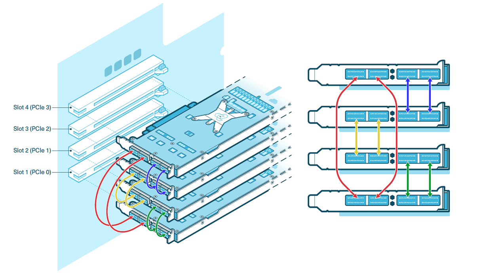

# Receiving, Unboxing, and Setup

This guide provides system administrators, hardware engineers, and users responsible for the initial setup of Tenstorrent hardware with step-by-step instructions. You will learn to safely unbox a TT-QuietBox Blackhole™ workstation, connect all required hardware components, and install the recommended operating system.

### **Metadata and Labels**

* **Product Names:** TT-QuietBox Blackhole™, Blackhole™ Networked AI Processor, Tensix core  
* **Technology Concepts:** PCIe, QSFP-DD, Installation, Setup, Electrostatic Discharge (ESD), Basic Input/Output System (BIOS)  
* **Document Type:** Task-Based Guide (How-To)

## **Before You Begin**

Before you begin, choose a clear, stable, and spacious area for the TT-QuietBox Blackhole™ workstation. The system ships in a palletized wooden crate. Ensure you have at least two people and enough room for them to maneuver comfortably and safely around the crate and system. Clear the area where you intend to use the TT-QuietBox Blackhole™ and ensure it has power, as specified in the electrical safety warning below. Also, confirm that all vents are clear of obstructions or other objects.

:::{warning}
The fully palletized and crated shipment weighs approximately 134 lbs (61 kg), and the workstation itself weighs approximately 80 lbs (36 kg). Unboxing and lifting require at least two people for safe maneuverability.

Do not proceed with unboxing or installation if you suspect shipping damage to the system. Contact Tenstorrent support at `support@tenstorrent.com` for assistance.
:::

### **Electrical Safety Warning**

:::{danger}
Failure to follow these electrical safety instructions may result in electric shock, fire, or damage to the equipment.
:::

* Connect the system to a dedicated AC power circuit with sufficient capacity to support the full power draw of the TT-QuietBox Blackhole™ workstation, including peak loads under heavy AI model execution.  
* Do not share the outlet with other high-power devices. Avoid using household surge strips, extension cords, or multi-outlet power taps; not all are rated for the sustained current of this system.  
* Use only the provided C13 power cable, and ensure it is plugged into a properly grounded outlet. Do not bypass or disable the grounding pin.  
* Verify that the circuit wiring and breaker rating meet or exceed the combined system requirements, including liquid-cooling support and all accelerator cards.  
* If the circuit becomes overloaded or if the breaker trips during power-up or operation, immediately disconnect and remove power. Then, have a qualified electrician inspect and verify the circuit’s capacity before resuming setup.  
* Never attempt to reset or bypass a tripped breaker without first confirming the circuit integrity; failure to do so may result in overheating, voltage drop, or irreversible damage.

### **ESD Safety Warning**

:::{admonition} Important
:class: warning
Before opening the TT-QuietBox Blackhole™ workstation or handling any internal components, you must discharge static electricity from your body to avoid damaging sensitive hardware. Electrostatic discharge can permanently damage Tensix cores, memory modules, or other components. Handle with care and always follow ESD-safe practices.
* Touch a grounded metal surface, such as a grounded rack, chassis, or power supply casing, before and during internal handling.  
* Ideally, wear an ESD wrist strap connected to a verified ground point.  
* Avoid working on carpeted floors or in low-humidity environments where static buildup is more likely.  
* Do not touch any processor, memory module, connector, or printed circuit board (PCB) circuitry unless absolutely necessary, and only after properly discharging.
:::


### **Required Tools**

For unboxing, you will need the following tools:

* Phillips head screwdriver  
* Scissors or a similar cutting tool

### **Operating System Installation Preparation**

The TT-QuietBox Blackhole™ workstation ships without a pre-installed operating system (OS). Tenstorrent recommends preparing a bootable Universal Serial Bus (USB) flash drive with an installer for Ubuntu 22.04 LTS (Jammy Jellyfish) to ensure compatibility with the Tenstorrent software stack. Refer to the [official Ubuntu tutorial on creating a bootable USB drive](https://ubuntu.com/tutorials/create-a-usb-stick-on-ubuntu#1-overview) for guidance.

For OS installation, you will need:

* USB flash drive with an installer for Ubuntu 22.04 LTS (Jammy Jellyfish)  
* Keyboard  
* Mouse  
* Monitor

---

## **Step 1: Unboxing the Workstation**

Follow these steps to unbox your TT-QuietBox Blackhole™ workstation:

1. **Position the crate.** Position the crate in your prepared unboxing area, ensuring ample space for two people to work around it.  


2. **Remove plastic wrap.** Remove the outer plastic wrap and cut the two lifting straps looped around the crate.  


3. **Open the crate.** Use a **Phillips head screwdriver** to remove the six screws from the top panel of the crate. Lift off the top panel.  


4. **Remove the system from the crate.** Remove the protective styrofoam from inside the crate. Use the two lifting straps to vertically lift the inner cardboard box out of the wooden crate. Do not tilt the box sideways during this process.  


5. **Open the cardboard box.** Cut the two lifting straps off the cardboard box and open the top flaps.  


6. **Unpack accessories.** Remove the documentation and the accessory bag from the box and set them aside.  


7. **Remove the workstation from the cardboard box.** Reach into the short sides of the box, secure your hands under the supportive styrofoam, and lift the TT-QuietBox Blackhole™ workstation out of the box. Place it in your workspace.  


8. **Remove additional packing material.** Remove any remaining packaging from the exterior of the TT-QuietBox Blackhole™ workstation.  


9. **Inspect the system.** Inspect the workstation to ensure all components are properly mounted and secured. The system ships with sufficient liquid coolant for long-term operation; adding or purchasing coolant is not necessary.

---

## **Step 2: Setting Up the Hardware**

Follow these steps to set up the hardware for your TT-QuietBox Blackhole™ workstation:

1. **Connect the power cable.** Connect the provided C13 power cable to the workstation and then to a dedicated power outlet.  


2. **Connect QSFP-DD cables.** The included Quad Small Form-factor Pluggable Double Density (QSFP-DD) cables enable high-speed interconnectivity between the Tenstorrent Tensix cores. Your system includes four Blackhole™ processors and eight external QSFP-DD cables to create the processor mesh. Connect the eight cables according to the system topology diagram below. Ensure each cable is aligned correctly and clicks into place; do not force the connections.  



3. **Connect to the network.** For host system network access, connect a standard Ethernet cable (Cat 6 or better, user-provided) to an RJ45 LAN port on the rear panel. The **LAN1** and **LAN2** ports are 10GbE, while **LAN3** and **LAN4**are 1GbE.


4. **Connect peripherals.** Connect your monitor, keyboard, and mouse (user-provided). A VGA-to-HDMI adapter is included for monitors that require an HDMI connection.  
5. **Power on the system.** Locate the main power supply switch on the rear of the workstation and set it to the **ON**position. Press the system power button on the front panel.

:::{note}
The system's initial hardware initialization during its first Power-On-Self-Test (POST) may require several minutes before displaying the BIOS screen.
:::

---

## **Step 3: Installing the Operating System**

To install Ubuntu 22.04 LTS, plug your prepared bootable USB drive into an available USB Type-A port. During the Power-On-Self-Test (POST), press a key to enter the boot menu or the system's setup utility.

:::{note}
The TT-QuietBox Blackhole™ workstation uses an ASRock Rack SIENAD8-2L2T motherboard. The full user manual is available for download from the [ASRock Rack product page](https://www.asrockrack.com/general/productdetail.asp?Model=SIENAD8-2L2T).
:::

### **Option 1: Using the Boot Menu**

1. Power on or restart the system.  
2. Press the `F11` key during POST to enter the boot menu.  
3. Select your USB flash drive from the list.  
4. Follow the on-screen Ubuntu installation prompts.

### **Option 2: Adjusting the Boot Order in UEFI**

1. Power on or restart the system.  
2. Press the `F2` or `Delete` key during POST to enter the Unified Extensible Firmware Interface (UEFI) setup utility.  
3. Navigate to the **Boot** section.  
4. Set your USB flash drive as the primary boot device.  
5. Select **Save Changes and Exit**; the system will restart and boot from your USB drive.  
6. Follow the on-screen Ubuntu installation prompts.

---

## **Step 4: Verify System Recognition of Blackhole p150c Accelerators**

Please execute these commands to download the latest list of PCI device IDs and list the recognized devices:
```bash
sudo update-pciids
lspci -d 1e52:
```

You should see an output which lists four recognized accelerators:
```
01:00.0 Processing accelerators: Tenstorrent Inc Blackhole
41:00.0 Processing accelerators: Tenstorrent Inc Blackhole
42:00.0 Processing accelerators: Tenstorrent Inc Blackhole
c1:00.0 Processing accelerators: Tenstorrent Inc Blackhole
```

:::{danger}
If you don’t see all four accelerators listed, please [raise a support request.](https://tenstorrent.atlassian.net/servicedesk/customer/portal/1). Our team will review your request and provide assistance.
:::

---

## **Step 5: Installing the Tenstorrent Software Stack**

After completing the operating system installation, proceed with [Installing the Tenstorrent Software Stack](../../getting-started/README.md).

---

## **Need Additional Support?**

If you encounter any issues, or have a question that isn't covered in the documentation, please [raise a support request.](https://tenstorrent.atlassian.net/servicedesk/customer/portal/1) Our team will review your request and provide assistance.
