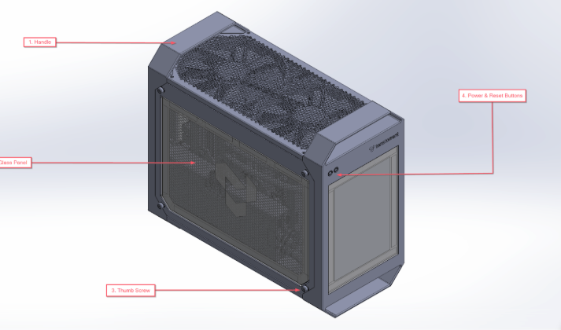

---
myst:
  html_meta:
    product-name: TT-QuietBox, Blackhole
    technology-concepts: specifications, requirements, hardware
    document-type: Reference
---

# Specifications and Requirements

*<span style="color: purple;">Note: This content is still being drafted. Once finalized, the complete documentation will be available at docs.tenstorrent.com</span>*

This document provides detailed technical specifications for the TT-QuietBox™ 2 (Blackhole™) Liquid-Cooled Desktop Workstation. It lists package contents, hardware components, physical dimensions, and operating requirements.

## **Package Contents**

The Tenstorrent TT-QuietBox 2 (Blackhole) system package includes the following items:

* 1x TT-QuietBox 2 (Blackhole) Workstation
* 1x Power Supply Cord (C19 to NEMA 5-15P)
* 1x AnkerWork S500 speakerphone and dongle (first 100 units)

For assembly instructions, refer to the [Unboxing and Setting Up the TT-QuietBox Workstation Guide](./setup.md). If you encounter issues, refer to the [Troubleshooting Common Hardware Issues page](./support-bh-2.md).

## **System Specifications**

| Specification | Details |
| ----- | ----- |
| Model | TW-04003 |
| CPU | Ryzen 7 9700X 65W Granite Ridge 3.8GHz |
| Motherboard | ASRock B850M-C, mATX |
| Memory | 256GB (4x64GB) DDR5-5600 UDIMM, CL46 (4 slots, 0 free) |
| Storage | 4TB (WDS400T4B0E-00BKY0)<br /> 1x Blazing M.2 (PCIe Gen5x4) with WD Blue SN5000 NVMe SSD<br /> 1x Hyper M.2 (PCIe Gen4x4)<br /> 1x M.2 (PCIe Gen3x2 & SATA3) |
| Tenstorrent Processors | 2x Liquid-Cooled Blackhole™ cards, each equipped with:<br /><ul style="margin-bottom: 0;"><li>2x Blackhole ASICs</li><li>240 Tensix Cores</li><li>64 GB of DDR6 Memory @ 16 GT/sec (1024 GB/sec memory bandwidth)</li><li>600W of board power</li></ul> |
| Host Connectivity | 2x WiFi Antenna Ports<br />1x HDMI Port<br />1x USB 3.2 Gen 2 Type-A Port<br />1x USB 3.2 Gen 2 Type-C Port (non-video)<br />2x USB 3.2 Gen1 Ports<br />4x USB 2.0 Ports<br />1 x RJ45 LAN Port<br />1 x BIOS Flashback Button<br />HD Audio Jacks: Line in / Front Speaker / Microphone |
| Power Supply | 1600W CoolerMaster V Platinum 1600 V2 |
| Operating System | Ubuntu 24.04.3 LTS |
| System Dimensions | 8.4” x 17.8” x 15.5” (W x D x H) / 21.4cm x 45.2cm x 39.3cm (including handles and feet) |
| System Weight | 20 kg (44.2 lbs) +/- 1.5 lbs   |
| Shipping Weight | TBD kg (TBD lbs)  |

## **System Overview**

*<span style="color: purple;">Note: These images are not final</span>*



| No | Item | Description |
| --- | --- | --- |
| 1 | Carrying Handle | Used to aid in lifting the server |
| 2 | Clear Panel | Showcases internal Accelerator cards and <br />permits tool-free access to the system. |
| 3 | Thumbscrew | Enables toolless access the internals |
| 4 | Power and Reset Buttons | Powers the Workstation on/off and resets the workstation |
| 5 | System Fans | Provides venting and system airflow management |
| 6 | Liquid Cooling Reservoir | For system thermal management |

## **System Rear View**

```{figure} ./draft-bh-qb-2-system-rear-view.png
:alt: QuietBox BH-2 system rear view
:width: 65%
```

| Letter | Item |
| --- | --- |
| a. | 1x HDMI Port |
| b. | 1 x BIOS Flashback Button |
| c. | 1x USB 3.2 Gen 2 Type-A Port |
| d. | 4x USB 2.0 Ports |
| e. | 1 x RJ-45 1GbE Realtek LAN Port |
| g. | HD Audio Jacks: Line in / Front Speaker / Microphone |
| h. | 1x USB 3.2 Gen 2 Type-C Port (non-video) |
| i. | 2x USB 3.2 Gen 1 Ports |

## **Internal Topology**
 The TT-QuietBox 2 is enabled by two Tenstorrent Blackhole cards, which are connected internally with a Samtec ARP6 series High Performance cable. The below topology is pre-installed by Tenstorrent, and is here for your reference.

```{figure} ./draft-bh-qb2-topology.png
:alt: QuietBox BH-2 internal topology
:width: 75%
```
## **Power Requirements**

* The workstation’s internal AC/DC power supply consists of one 1600-watt 80 Plus Titanium Power Supply Unit (PSU).
* The expected peak power consumption of the Workstation is 1.5kW.
* For maximum efficiency, ensure your outlet can handle 100-240V (15A is recommended).

## **Enviornment**

The TT-QuietBox 2 is designed to operate in these conditions:

* Operating temperature: 10C-35C
* Operating relative humidity: 20% to 85%
* Storage temperature: -40°C to 70°C (-40°F to 158°F)
* Storage relative humidity: 10% to 95%

(safety-warnings)=
## **Safety Warnings**

### **Electrical Safety** 

:::{danger}
Failure to follow these electrical safety instructions may result in electric shock, fire, or damage to the equipment.
:::

* Connect the system to a dedicated AC power circuit with sufficient capacity to support the full power draw of the TT-QuietBox 2 workstation, including peak loads under heavy AI model execution.  
* Do not share the outlet with other high-power devices. Avoid using household surge strips, extension cords, or multi-outlet power taps; not all are rated for the sustained current of this system.  
* Use only the provided C19 power cable, and ensure it is plugged into a properly grounded outlet. Do not bypass or disable the grounding pin.  Using a non-Tenstorrent approved power cable may result in dangerous operating conditions.
* Verify that the circuit wiring and breaker rating meet or exceed the combined system requirements, including liquid-cooling support and all accelerator cards.  
* If the circuit becomes overloaded or if the breaker trips during power-up or operation, immediately disconnect and remove power. Then, have a qualified electrician inspect and verify the circuit’s capacity before resuming setup.  
* Never attempt to reset or bypass a tripped breaker without first confirming the circuit integrity; failure to do so may result in overheating, voltage drop, or irreversible damage.

### **Electrostatic Discharge Safety**

:::{admonition} Important
:class: warning
Before opening the TT-QuietBox 2 Blackhole workstation or handling any internal components, you must discharge static electricity from your body to avoid damaging sensitive hardware. Electrostatic discharge can permanently damage Tensix cores, memory modules, or other components. Handle with care and always follow ESD-safe practices.
* Touch a grounded metal surface, such as a grounded rack, chassis, or power supply casing, before and during internal handling.  
* Ideally, wear an ESD wrist strap connected to a verified ground point.  
* Avoid working on carpeted floors or in low-humidity environments where static buildup is more likely.  
* Do not touch any processor, memory module, connector, or printed circuit board (PCB) circuitry unless absolutely necessary, and only after properly discharging.
:::

## **Notice to Users**

* This equipment has been tested and found to comply with the limits for a Class B digital device, pursuant to part 15 of the FCC Rules. These limits are designed to provide reasonable protection against harmful interference in a residential installation.
* This equipment generates, uses and can radiate radio frequency energy and, if not installed and used in accordance with the instructions, may cause harmful interference to radio communications. However, there is no guarantee that interference will not occur in a particular installation.
* Changes or modifications to this Workstation which are not expressly approved by Tenstorrent may void the user's authority to operate it. Tenstorrent cannot accept responsibility for any failure to satisfy any Safety, EMC or regulatory requirements that result from non-approved modification of the product, including the fitting of non-Tenstorrent cards, cables, or any other hardware or software modification which may affect compliance. To avoid damage and personal injury, only use Tenstorrent approved hardware with this device. 
* Do not use the TT-QuietBox 2 in a way that it was not designed to be used.
