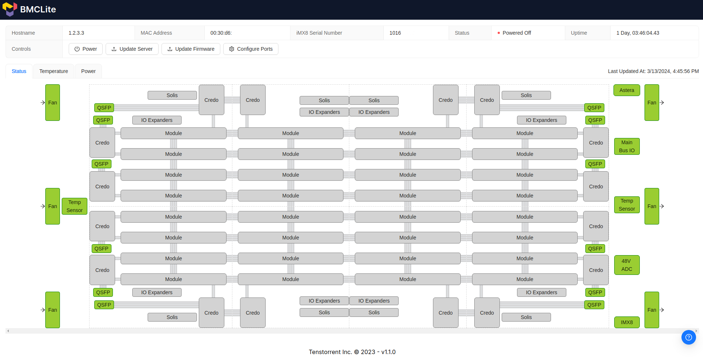

# Firmware Updates

The Galaxy system has multiple things that are typically referred to as 'firmware' this page is here to help disambiguate them, as well as help to understand the update process of each.

## The various 'firmware's

### Galaxy Management Controller

The Galaxy Management Controller has a Linux based custom distribution that runs on it, and it is sometimes referred to as 'firmware'.  This only includes the firmware of the Galaxy Management Controller itself, as well as the various retimers and such to make the high speed network interfaces present on the Galaxy work.

This **DOES NOT** include the AI chip's firmware, that is separate from this firmware, though the Galaxy Management Controller is used in the update of the AI chip's firmware.

### AI Chip's firmware

The AI chip's themselves have their own firmware that is independent of the Galaxy Management Controller.  The Galaxy Management Controller is used, by way of BMCLite to update those chips.

## Mender - For the Galaxy Management Controller itself
This is also made note of in the [Security Callouts](security-callouts.md#mender-update-system), but we make use of the [Mender.io](https://mender.io) update system as it is integrated into the Galaxy Management Controller.

### Over-the-air Updates

The Galaxy systems ship in such a configuration that they will, upon getting a network connection that allows them, to check in with Mender and associate to the updates channel for Tenstorrent.  This allows Tenstorrent to roll out updates for the Galaxy Management Controller similar to how updates for a cell phone are rolled out.  This keeps the systems up to date, and allows us to get updates out promptly.  Updating the Galaxy Management Controller is specifically designed to not cause issues with running workloads and would only cause a minimal outage as the system reboots after an update.

### Offline 

Mender can run in what it calls '[standalone deployment](https://docs.mender.io/artifact-creation/standalone-deployment)' mode, which allows for the disabling of the `mender-updated` system service.  For the Galaxy Management Controller to be updated this way it would roughly follow the process provided in [Mender's Docs here](https://docs.mender.io/artifact-creation/standalone-deployment)

1. Acquire the appropriate `.mender` file from Tenstorrent
2. Upload the `.mender` file to the Galaxy Management Controller via `scp`.  It is recommended to use the `/data/` directory for this upload
3. Follow the steps for [Deploy an Artifact to a device](https://docs.mender.io/artifact-creation/standalone-deployment#deploy-an-artifact-to-a-device)
4. Delete the `.mender` you uploaded after the update is complete as the Galaxy Management Controller has limited scratch space for this kind of data.

### Using your own Mender account/instance

This is possible, but it's something that should be well understood before undertaking.  This is done by using `ssh` to connect to the Galaxy Management Controller.  Once connected, and using the root account, or sudo you would run the `mender setup` and follow the information concerning a deployment from [Mender's Client Configuration](https://docs.mender.io/artifact-creation/standalone-deployment#deploy-an-artifact-to-a-device)

> **Note:** Tenstorrent does not directly support this type of deployment, this effectively puts the end user as their own update provider.  Updates would be uploaded to Mender by the user that would normally be used in the `Offline` update section above.

## BMCLite - AI Chip Firmware Update

BMCLite has a mechanism to update the firmware present on the AI chips themselves.  This is done by navigating to the BMCLite page for your Galaxy and selecting the 'Update Firmware' button as can be seen below

This will run through the needed steps to update the firmware on the Galaxy itself.  This is also doable via API calls to BMCLite, if you need that functionality please reach out to Tenstorrent about how to access that.