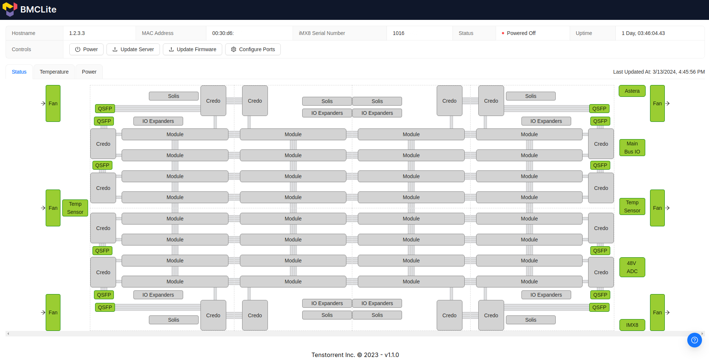

# Galaxy 4u - Galaxy Management Controller - Getting started

## Where to start, what is this
This is not intended to be a comprehensive guide to the Galaxy 4U system.  This is intended to expand on the existing documentation that's on [Docs - Galaxy 4U](https://docs.tenstorrent.com/tenstorrent/workstation-and-server-systems/galaxy-4u-server) and act as a jumping off point to more directly discuss what's going on with the Galaxy 4U hardware and it's BMC related activities.

For Hardware setup please refer to [Docs - Galaxy 4U - Hardware Installation](https://docs.tenstorrent.com/tenstorrent/workstation-and-server-systems/galaxy-4u-server/hardware-installation)

## Where to start

#### BMC
The Galaxy 4U has an in-built Baseboard Management Controller (BMC), it is somewhat similar to how a server's IPMI works but does not provide the same kind of interfaces as it's targetted at the Galaxy 4U specifically.

##### BMC Network
It has a single external interface that can be seen at position 5 of the following diagram

This interface is a standard 1000BaseT network interface, and is only used for interacting with the BMC of the Galaxy 4U.

>Note: The BMC can run independently without network access, however this means that resetting both the Galaxy or the individual AI chip inside is not available.  This would mean the only way to reset/reboot the Galaxy or any of the AI chips inside would be to power cycle the entire Galaxy either at the power supply or at the power feed itself.  It also prevents Galaxy Management Controller updates as well as firmware updates for the.

The Galaxy 4U's network and configuration is detailed in the [Network Config](networkconfig.md) section, but what follows is a brief summary.

The system has a preference for getting an IP address from DHCP for IPv4 and SLAAC for IPv6.  It will attempt to acquire a DHCP address for about 30 seconds before falling back to a static IP address of `192.168.201.6/24`, which is also present during the DHCP acquisition stage.  Upon a successful DHCP request `192.168.201.6/24` is removed from the network interface.

For more details on what ports are open, what's accessible, etc please refer to the [Network Config](networkconfig.md) section.

### Cockpit
The system comes with [Cockpit](https://cockpit-project.org/) installed to allow for some basic system management.  This is present on TCP port `9090` of the Galaxy's IP address and provides the ability to configure or view, for the BMC:
- System Logs
- Network Configuration (see the [Network Config](networkconfig.md) section for help)
- Accounts on the system
- Running Services
- System Terminal

You log in via a local system account on the BMC.  Please see [Security callouts](security-callouts.md) for information on default credentials.

### BMCLite
The system comes with BMCLite, which is a Tenstorrent web interface to the Galaxy system.  This provides some basic configuration, power control, and ability to update the firmware on the AI chips themselves, as well as providing some basic information regarding the status of the Galaxy system.

